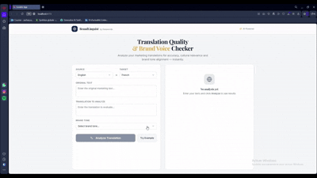

# Datawords-Demo


*Si la vidéo ne s’affiche pas : [ouvrir Datawords.mp4](Datawords.mp4) directement.*

## Présentation du projet

**Datawords-Demo** est une démo technique réalisée dans le cadre d’un assignment. Datawords Group accompagne plus de 1 500 marques internationales pour gérer leur contenu dans 25 pays et 75+ langues. L’entreprise mène une transformation stratégique portée par l’IA.

L’objectif de ce projet : ident le ifier un cas d’usage à forte valeur, natif IA, pertinent pourmétier et les clients de Datawords, puis concevoir et livrer une solution fonctionnelle de bout en bout, testable de manière autonome par tout utilisateur, sans configuration ni assistance.

---

## Cas d’usage : Contrôle qualité de traduction et ton de marque (IA)

### Concept

Outil piloté par l’IA qui **analyse automatiquement une traduction marketing** et détecte :

- les erreurs de traduction ;
- les pertes de sens ;
- les problèmes de ton de marque ;
- les incohérences marketing.

L’IA fournit ensuite :

- un **score de qualité** ;
- une explication des problèmes détectés ;
- une **traduction améliorée** proposée.

### Principe d’utilisation

**Entrées :**

- Texte original  
- Traduction à analyser  
- Ton de marque (ex. Luxury / Elegant)

**Sorties :**

- Score de traduction  
- Problèmes détectés  
- Traduction améliorée suggérée

L’outil est conçu pour une démo rapide : on colle un texte → le résultat s’affiche immédiatement.

---

## Exemple concret

### Entrée

- **Original (anglais)**  
`Unleash your wild side with our new luxury fragrance.`
- **Traduction (français)**  
`Libérez votre côté sauvage avec notre nouveau parfum de luxe.`
- **Ton de marque**  
`Luxury / Elegant`

### Sortie (exemple)

- **Score de traduction :** 68 / 100  
- **Problèmes détectés :**  
  1. *Brand tone mismatch* — L’expression « côté sauvage » est trop agressive pour une marque de parfum de luxe.
  2. *Cultural nuance* — Le marketing du luxe en France privilégie un langage plus raffiné.
- **Traduction suggérée :**  
`Révélez votre élégance naturelle avec notre nouveau parfum de luxe.`

---

## Architecture

Flux global : **Utilisateur → Interface React → Backend Flask → LLM (Ollama)**.

```
Utilisateur
    ↓
Interface React (Vite + TypeScript + Tailwind + shadcn/ui)
    ↓
Backend Flask (Python)
    ↓
Ollama (modèle LLM)
```

### Backend

- **Stack :** Python + Flask  
- **Endpoint principal :** `POST /analyze`

**Corps de la requête (JSON) :**


| Champ             | Description                    |
| ----------------- | ------------------------------ |
| `original_text`   | Texte source                   |
| `translated_text` | Traduction à analyser          |
| `brand_tone`      | Ton de marque                  |
| `source_language` | (optionnel) Code langue source |
| `target_language` | (optionnel) Code langue cible  |


**Réponse (exemple) :**

- `score` — score de qualité  
- `issues` — liste des problèmes détectés  
- `suggested_translation` — traduction améliorée proposée

Un endpoint **GET /health** permet de vérifier que le backend et le modèle sont disponibles.

---

## Infrastructure

Le projet s’exécute avec **Docker Compose** depuis le dossier `Infra/`.

### Services


| Service         | Rôle                                                      | Port  |
| --------------- | --------------------------------------------------------- | ----- |
| **ollama**      | Serveur Ollama pour le modèle LLM                         | 11434 |
| **ollama-init** | Initialisation : téléchargement du modèle                 | —     |
| **backend**     | API Flask (analyse de traduction)                         | 5001  |
| **frontend**    | Application React (Vite, TypeScript, Tailwind, shadcn/ui) | 4173  |


### Volumes

- **ollama** : persistance des modèles Ollama (`/root/.ollama`).

### Lancer le projet

À la racine du dépôt :

```bash
docker compose -f Infra/docker-compose.yml up --build
```

**Premier lancement :** au premier démarrage, le modèle LLM (ex. `qwen3-coder:30b`) est téléchargé par le service `ollama-init`. Il faut **attendre la fin de ce chargement** avant que l’analyse ne fonctionne (plusieurs minutes selon la connexion). Les logs Docker indiquent la progression ; une fois le pull terminé, le backend peut appeler le modèle.

Puis ouvrir dans le navigateur : **[http://localhost:4173](http://localhost:4173)** (frontend).  
L’API backend est accessible sur **[http://localhost:5001](http://localhost:5001)**.

### Variables d’environnement (backend)

Vous pouvez définir ces variables dans un fichier **`.env`** à la racine du projet (ou dans le dossier `Infra/` selon votre configuration Docker) pour personnaliser le backend. Elles sont lues par `backend/src/config.py` :

| Variable            | Description                              | Défaut                |
| ------------------- | ---------------------------------------- | --------------------- |
| `OLLAMA_BASE_URL`   | URL du serveur Ollama                    | `http://ollama:11434` |
| `OLLAMA_MODEL`      | Nom du modèle à utiliser                 | `qwen3-coder:30b`     |
| `PORT`              | Port d’écoute du backend                 | `5001`                |
| `FLASK_DEBUG`       | Mode debug Flask (`true` / `false`)      | `false`               |

Exemple de `.env` :

```env
OLLAMA_BASE_URL=http://ollama:11434
OLLAMA_MODEL=qwen3-coder:30b
PORT=5001
FLASK_DEBUG=false
```

---

## Résumé

- **But :** Démo d’un analyseur de qualité de traduction marketing et de ton de marque, piloté par l’IA.  
- **Stack :** React + Vite + TypeScript + Tailwind + shadcn/ui (frontend), Flask (backend), Ollama (LLM).  
- **Infra :** Docker Compose (Ollama, backend, frontend).  
- **Usage :** `docker compose up --build` puis accès au frontend sur le port 4173.

